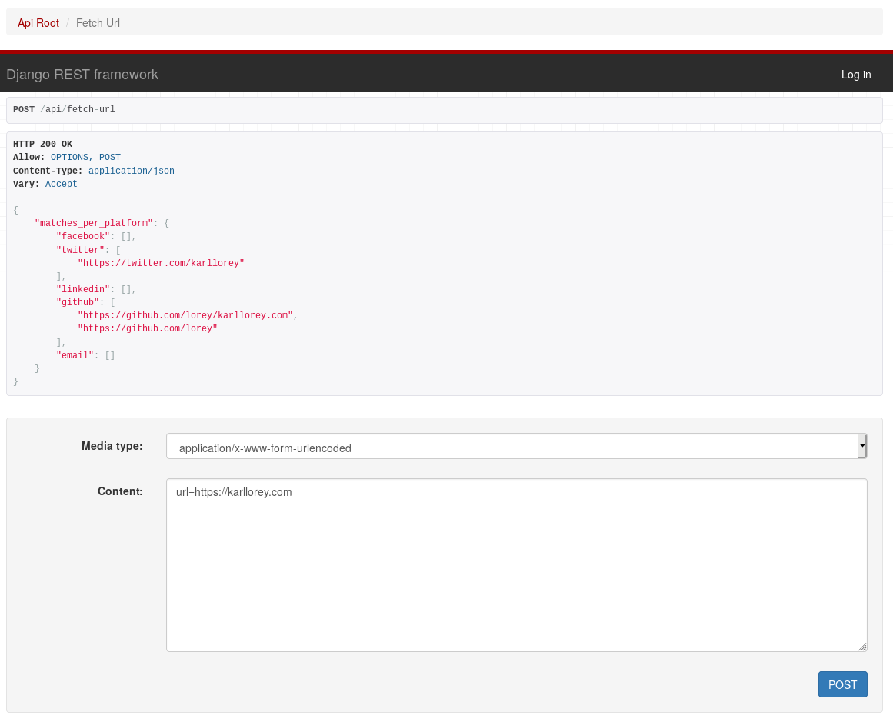

# socials API: extract social media profiles
The socials API allows you to extract social media profiles from urls.
It is an API version of my library called [socials for Python](https://github.com/lorey/socials).

It's free to use with a rate-limit of 60 requests per hour.

## Example
Requesting `/api/fetch-url` with a POST request and `url=https://karllorey.com` as parameter will return all social media profiles linked from [karllorey.com](https://karllorey.com) (my personal website):

```json
{
    "matches_per_platform": {
        "facebook": [],
        "twitter": [
            "https://twitter.com/karllorey"
        ],
        "linkedin": [],
        "github": [
            "https://github.com/lorey/karllorey.com",
            "https://github.com/lorey"
        ],
        "email": []
    }
}
```

## Test it (with the provided web interface)
1. Go to `/api/fetch-url`
2. Select for `Media type`: `application/x-www-form-urlencoded`
3. Enter in `Content`: `url=https://karllorey.com` or any other url



## Set it up for yourself
socials API is dockerized and can be set up via docker-compose within seconds:
```bash
docker-compose build
docker-compose up -d
```

It should now be accessible at http://localhost:8016.
Make sure to adapt the [rate limit in `socials_api/settings.py`](socials_api/settings.py).

# References
- [socials](https://github.com/lorey/socials), a Python library to check if urls are social media profiles
- [social-media-profiles-regexs](https://github.com/lorey/social-media-profiles-regexs):
  extract urls of social media profiles with regular expressions
